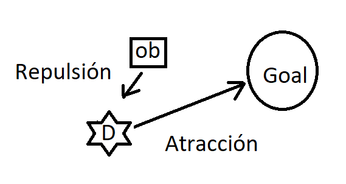
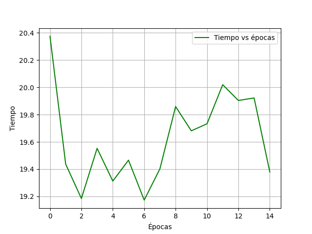

# Potential-Field-Algorithm-Optimization-Using-PSO
Optimize potencial fields algorithm for a system navigation of a dron using the PSO method.

#### This repository have a report in PSO_Drone/PSO_Drone.pdf

## Introduction

The use of robots to minimize human labor has been
become a very important field of research.
From the use of mobile robots for cleaning, to robots
military, robotics has become an important field
for the development of humanity. However, a field
important to address are unmanned vehicles which
They need a system that detects and avoids obstacles. the algorithm
Potential field is one of the most important algorithms
and traditional to solve this type of problem. East
algorithm depends on different parameters, which are
can be defined in different ways. This document proposes
obtaining these parameters through the use of a
optimization algorithm called PSO.

### Scene

### Examples

### Result Time vs Epoch

